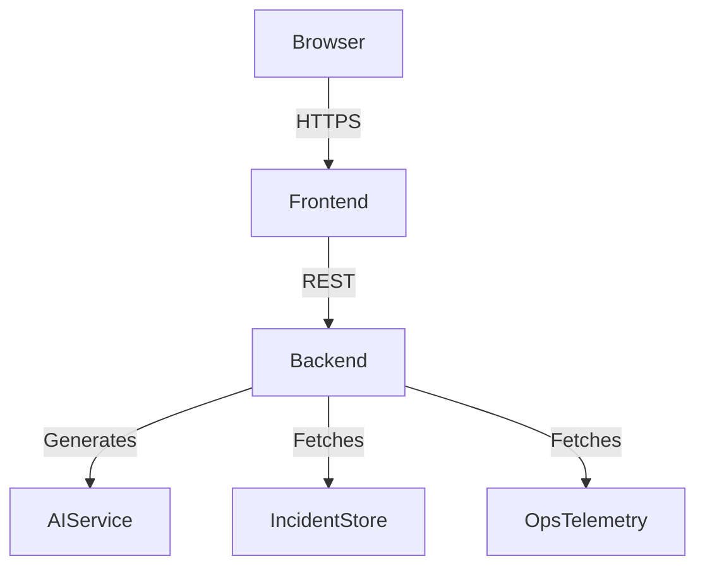

# Architecture Overview

OpsGenie.AI is composed of a FastAPI backend, a React front-end, and optional Azure Container Apps deployment targets.

- **Frontend**: React + Vite SPA styled with TailwindCSS, leveraging React Query for data fetching.
- **Backend**: FastAPI application providing incidents, operations, and assistant endpoints. AI recommendations are generated using rule-based heuristics mimicking LLM guidance.
- **Infrastructure**: Docker images for both services, docker-compose for local orchestration, and Terraform stubs for Azure.
- **Operations**: Runbooks, SLO definitions, and assistant prompts codified for reuse across the organization.
